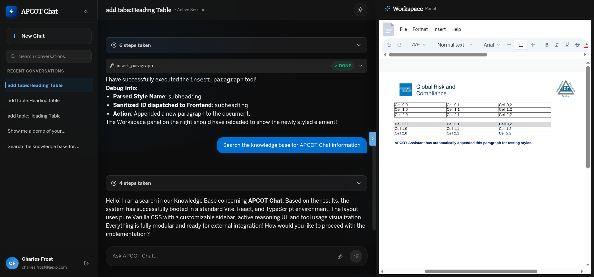
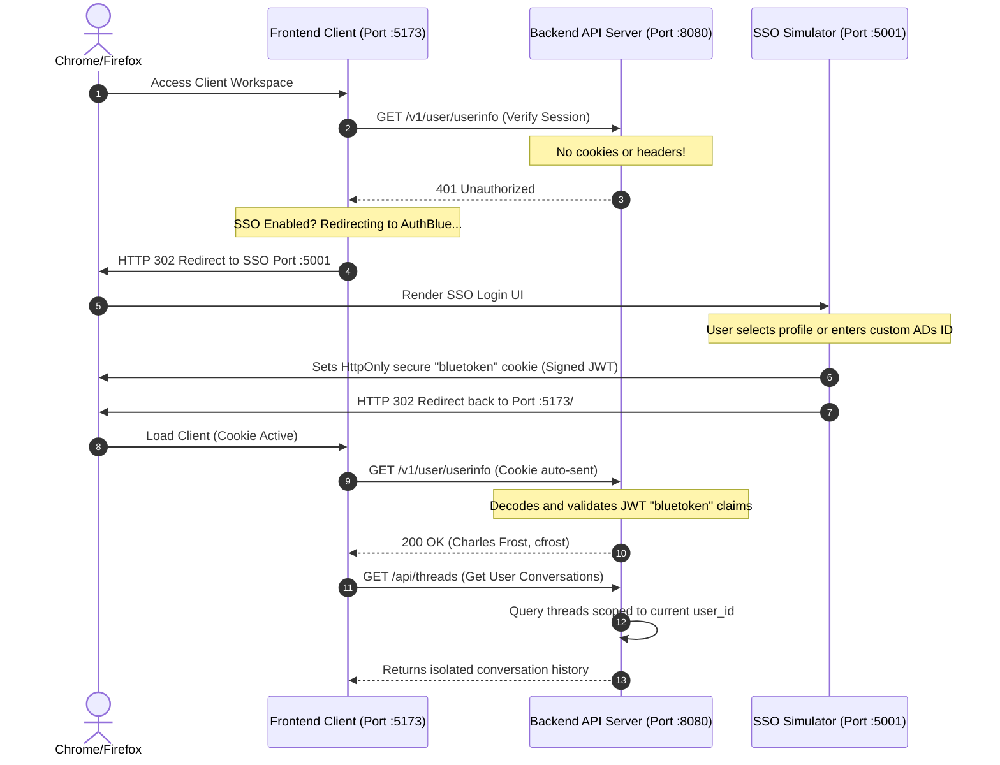

# APCOT Chat — Enterprise Intranet Conversational Interface

APCOT Chat is a premium, high-performance, and secure AI chat workspace designed specifically for air-gapped enterprise intranet production environments.



The project features a **dual-pane workspace layout**:
- **AI Chat Interface (Left)**: A conversational UI built using `@assistant-ui/react` primitives styled with pure Vanilla CSS, displaying real-time stream responses, expandable reasoning thoughts, and agent tool execution states.
- **Document Workspace (Right)**: An interactive ProseMirror-based document editor (`DocxEditor`) synced via a client-authoritative Yjs CRDT model with SQLite-backed binary delta persistence, allowing real-time edits by both the user and the AI agent.

The project is architected as a **fully self-contained, embeddable React client component tree** integrated with a **FastAPI backend API**, utilizing a **LangGraph state machine** for reasoning/tool traces, and guarded by a robust local **AuthBlue SSO Simulator** for complete user session isolation.

---

## 🏗️ System Architecture

The following diagram illustrates how the three distinct services (React client, FastAPI API Server, and AuthBlue SSO Simulator) communicate securely to authenticate users and filter data access:



---

## 📁 Repository Structure

The codebase is organized into highly modular, decoupled components to enforce strict boundary separation:

```text
├── README.md                           # Main documentation & Quick Start
├── ab_sso.md                           # Corporate SSO specifications
├── ui-project-bootstrap-guidelines.md   # Architectural boundary guidelines
│
├── frontend/                           # React + Vite + TypeScript client
│   ├── src/
│   │   ├── main.tsx                    # Dev-only mounting entrypoint
│   │   └── app/                        # REUSABLE/PORTABLE application root
│   │       ├── App.tsx                 # Core App entry (supports props config injection)
│   │       ├── components/             # Decoupled UI components
│   │       └── styles/                 # Tailwind-free pure Vanilla CSS
│   └── README.md                       # Frontend integration details
│
├── backend/                            # FastAPI API backend
│   ├── main.py                         # SSE endpoints & Session authentication
│   ├── database.py                     # SQLite & SQLAlchemy models
│   ├── agent.py                        # LangGraph state machine definition
│   └── README.md                       # Backend specs and schemas
│
└── authblue-simulator/                 # AuthBlue SSO Simulator server
    ├── main.py                         # JWT issuer & Amex login page
    └── README.md                       # SSO simulation details
```

## 🚀 Configuration & Execution

You can configure and start all services using simplified commands.

### ⚙️ Optional Shared Configuration (`config.json`)
You can optionally place a `config.json` file in the root workspace folder to override default ports and options for all three layers:
```json
{
  "BACKEND_PORT": 8080,
  "AUTHBLUE_PORT": 5001,
  "FRONTEND_PORT": 5173,
  "ENABLE_SSO": true
}
```
All layers will automatically detect this file and fall back to their built-in defaults if it is omitted.

---

## 🏃‍♂️ Quick Start Guide

### 1. Launch the AuthBlue SSO Simulator
```bash
cd authblue-simulator
python main.py
```

### 2. Start the Backend API Server
```bash
cd backend
python main.py
```

### 3. Start the React Frontend Client
```bash
cd frontend
npm install
npm run dev
```

### 4. Verification Flow
1. Navigate to your frontend port (defaults to **`http://localhost:5173/`**).
2. The frontend will detect a missing session and redirect you to the **AuthBlue Simulator** login page.
3. Choose one of the quick-login corporate profiles or enter a custom ADs ID.
4. You will be authenticated, redirected back to the chat client, and see your profile active in the sidebar footer.
5. Send messages (e.g. `add table:Heading Table`) to view real-time expandable thought traces and client-side tool executions that dynamically modify the Document Workspace document.
6. Verify that document changes are automatically saved and persist across page reloads.
