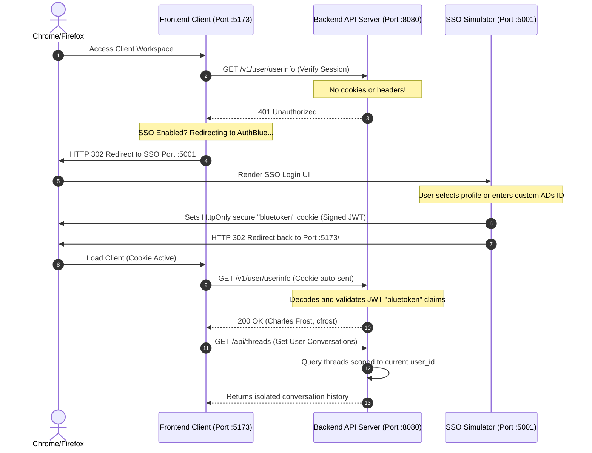

# APCOT Chat — Enterprise Intranet Conversational Interface

APCOT Chat is a premium, high-performance, and secure AI chat workspace designed specifically for air-gapped enterprise intranet production environments.

The project is architected as a **fully self-contained, embeddable React client component tree** integrated with a **FastAPI backend API**, utilizing a **LangGraph state machine** for reasoning/tool traces, and guarded by a robust local **AuthBlue SSO Simulator** for complete user session isolation.

---

## 🏗️ System Architecture

The following diagram illustrates how the three distinct services (React client, FastAPI API Server, and AuthBlue SSO Simulator) communicate securely to authenticate users and filter data access:



---

## 📁 Repository Structure

The codebase is organized into highly modular, decoupled components to enforce strict boundary separation:

```text
├── README.md                           # Main documentation & Quick Start
├── ab_sso.md                           # Corporate SSO specifications
├── ui-project-bootstrap-guidelines.md   # Architectural boundary guidelines
│
├── frontend/                           # React + Vite + TypeScript client
│   ├── src/
│   │   ├── main.tsx                    # Dev-only mounting entrypoint
│   │   └── app/                        # REUSABLE/PORTABLE application root
│   │       ├── App.tsx                 # Core App entry (supports props config injection)
│   │       ├── components/             # Decoupled UI components
│   │       └── styles/                 # Tailwind-free pure Vanilla CSS
│   └── README.md                       # Frontend integration details
│
├── backend/                            # FastAPI API backend
│   ├── main.py                         # SSE endpoints & Session authentication
│   ├── database.py                     # SQLite & SQLAlchemy models
│   ├── agent.py                        # LangGraph state machine definition
│   └── README.md                       # Backend specs and schemas
│
└── authblue-simulator/                 # AuthBlue SSO Simulator server
    ├── main.py                         # JWT issuer & Amex login page
    └── README.md                       # SSO simulation details
```

---

## 🚀 Quick Start (Local Run Guide)

Follow these steps to run the complete workspace locally. You will need a standard Python 3.11+ environment and Node.js.

### 1. Launch the AuthBlue SSO Simulator
The simulator generates a browser-wide cookie session representing your authenticated intranet user.
```bash
cd authblue-simulator
# Use your active Python environment to launch the Uvicorn server
python -m uvicorn main:app --port 5001 --reload
```

### 2. Start the Backend API Server
The API server hosts thread persistence and the LangGraph conversational graph.
```bash
cd backend
python -m uvicorn main:app --port 8080 --reload
```

### 3. Start the React Frontend Client
```bash
cd frontend
npm install
npm run dev
```

### 4. Verification Flow
1. Navigate to **`http://localhost:5173/`** in your browser.
2. The frontend will detect a missing session and redirect you to the **AuthBlue Simulator** page on `http://localhost:5001/login`.
3. Choose one of the quick-login corporate profiles (e.g. **Charles Frost**) or enter a custom ADs ID.
4. You will be authenticated, redirected back to the chat client, and see your customized profile initialized in the sidebar footer.
5. Create conversations and observe the live, expandable thought traces and tool executions streaming directly from the LangGraph backend!
