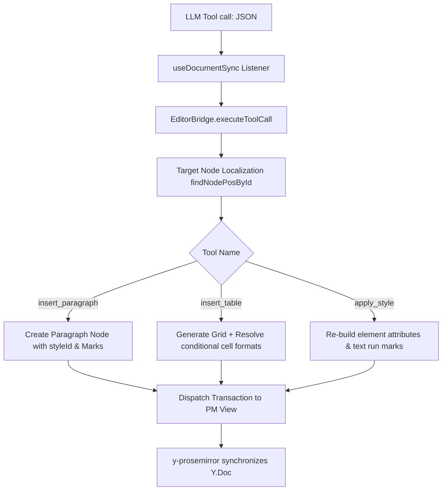

# DOCX Editor Elements & Styling Architecture Guide

This guide details the architectural design, element lifecycles (CRUD), and styles management flow within the collaborative document editor. It serves as a master handoff document for engineers rebuilding or expanding the document editing and styling system.

---

## 1. Mandatory Reading Order (Theory & Specs)
To build the required context, read the following specifications and documentation files in this exact order:

1. **`labs/doc_state_management_architecture.md`**
   - *Purpose*: Explains the core philosophy of **Frontend-Authoritative state execution** via Yjs CRDTs. Re-establishes the boundary between the Python backend (which only compiles Markdown and commits binary blobs) and the React frontend (which holds the schema authority).
2. **`labs/docx-agent-tools.md`**
   - *Purpose*: Defines the catalog of native tools (such as `read_document`, `apply_formatting`, `set_paragraph_style`) and the **locate-then-mutate** pattern using Word-compatible `paraId` identifiers.
3. **`labs/stateless-remote-tool-execution.md`**
   - *Purpose*: Details the flow of streaming remote tool calls from the LLM down to the frontend using the LangGraph transaction/interrupt cycle.
4. **`labs/paragraph-styles.md`, `labs/character-styles.md`, & `labs/table-styles.md`**
   - *Purpose*: Document the exact JSON representations of paragraph, character, and table style properties extracted from the latent DOCX template file.

---

## 2. Mandatory Reading Order (Codebase)
Once you understand the specs, analyze the code files in this sequence:

1. **`frontend/src/sync/EditorBridge.ts`**
   - *Core Focus*: The absolute core of element mutation and style resolution. Study how it maps LLM tool parameters to ProseMirror transactions, parses style hierarchies, and overrides formatting.
2. **`frontend/src/app/components/DocumentWorkspace/DocxEditorWrapper.tsx`**
   - *Core Focus*: Inspect how the editor mounts, fetches plugins from the `SyncEngine`, and forces the zoom level to `1.0` to prevent floating menu misalignments.
3. **`frontend/src/app/components/DocumentWorkspace/useDocumentSync.ts`**
   - *Core Focus*: Trace the event listener loop (`ExecuteFrontendTool` and `StreamComplete`) which intercepts remote tool streams, routes them to `EditorBridge.ts`, and executes commits.
4. **`backend/core/yjs_extractor.py`**
   - *Core Focus*: Understand how Yjs XML/Map trees are traversed on the backend and serialized into clean, ID-annotated Markdown to feed the LLM context.
5. **`backend/core/llm_orchestrator.py`**
   - *Core Focus*: Look at the symmetrical OpenAI-compatible tool schemas (`insert_paragraph`, `apply_style`, etc.) that the LLM uses to invoke edit commands.

---

## 3. Element Lifecycle Management (CRUD)
The editor manipulates document elements (Paragraphs, Tables, Lists) by translating high-level JSON tool payloads into transactional ProseMirror AST mutations.



### 3.1 Target Localization: The `paraId` Handle
Word documents assign stable 8-character hex identifiers to paragraphs (`w14:paraId`). The editor represents these as node attributes (`id` or `paraId`).
- To mutate an element, `EditorBridge` uses the helper function `findNodePosById(targetId)`.
- It performs a depth-first traversal of the ProseMirror document using `doc.descendants()`.
- Once found, it returns the absolute document position (`pos`) and the `Node` object itself:
```typescript
private findNodePosById(targetId: string): { pos: number; node: PMNode } | null {
  let result = null;
  this.view.state.doc.descendants((node, pos) => {
    if (node.attrs && node.attrs.id === targetId) {
      result = { pos, node };
      return false; // Terminate search branch early
    }
    return true;
  });
  return result;
}
```

### 3.2 Inserting Paragraphs (`insert_paragraph`)
When the LLM calls `insert_paragraph`, the bridge:
1. Resolves insertion position (either `before` or `after` the target `paraId`). If targeting `editor_root`, it appends to the end of the document.
2. Generates a fresh, unique 8-character hex ID via `genParaId()` to populate the new paragraph's `paraId` attribute.
3. Resolves the specified `styleId` (see Section 4).
4. Merges paragraph-level block properties (`pPr` - e.g., spacing, alignments) into the node's attributes.
5. Creates run-level text marks (`rPr` - e.g., bold, color) and applies them to the text node.
6. Sets the `defaultTextFormatting` attribute on the paragraph node so that subsequent text typed by the user in this paragraph retains the style's character settings.
7. Inserts the node: `tr.insert(insertPos, pNode)`.

### 3.3 Inserting Tables (`insert_table`)
Tables are complex grid elements. The bridge handles table insertion by:
1. Generating a `columnWidths` array based on the target column count to evenly divide the document width (totaling `9000` dxa units).
2. Traversing rows (`i`) and columns (`j`) to build nested row (`table_row`) and cell (`table_cell`) ProseMirror nodes.
3. Resolving the table's active style.
4. Calling `resolveCellFormatting(r, c, totalRows, totalCols, style, theme)` to compute cell-specific borders and shading (see Section 4.5).
5. Populating each cell with a default paragraph containing text (`"Cell i,j"`) styled with the cell's resolved text formatting.
6. **Focus Trap Prevention**: Automatically inserts an empty paragraph node (`{ paraId }`) directly after the table so the user can easily click and type below the table without getting stuck in ProseMirror cell boundaries.

### 3.4 Removing Elements & Deletion
- **Manual Deletions**: Standard keyboard edits (Backspace/Delete) are handled natively by ProseMirror. `y-prosemirror` automatically translates these events into Yjs delta updates to synchronize with other users/agents.
- **LLM Deletions**: The LLM deletes text by calling `suggest_change` with a non-empty `searchString` and setting `replaceString` to `""`. 
- **Block Deletion**: If block-level deletion is required, the bridge can be extended to replace the range occupied by `findNodePosById(targetId)` with an empty fragment.

---

## 4. Styles Management Flow (Deep Dive)
Styling in a DOCX-backed editor is complex due to Word's reliance on theme colors, inheritance, and conditional table styling.

```
[templates.styles] -> [Extracted JSON] -> [DocxEditor.package.styles]
                                                 |
                                         resolveStyle(styleId)
                                                 |
                                     (Recursively walk 'basedOn')
                                                 |
                                     resolveThemeColor(rgb/tint)
                                                 |
                          +----------------------+----------------------+
                          |                                             |
             Block Attributes (pPr / tblPr)             Inline Marks (rPr)
            (e.g., spacing, cell background)        (bold, color, fontSize)
                          |                                             |
                          v                                             v
              PM Node Attributes & Borders               ProseMirror Text Marks
```

### 4.1 Seeding Styles from Templates
- When a document workspace loads, the frontend downloads the template metadata.
- The editor's native document object contains the loaded design tokens under `editorRef.current.getDocument().package.styles.styles`.
- This is a flat array of style definitions, containing block-level properties (`pPr`), run-level properties (`rPr`), and conditional table styles (`tblStylePr`).

### 4.2 Fuzzy Name Mapping
The LLM or external agents often request styles using colloquial names (e.g. `"heading 1"` or `"Table Grid"`). `EditorBridge` maps these names to standard DOCX XML style IDs using two techniques:
1. **PascalCase Conversion**:
   ```typescript
   private getStandardStyleId(requestedStyleName: string | undefined): string | undefined {
     if (!requestedStyleName) return undefined;
     return requestedStyleName
       .split(/[\s_\-]+/)
       .map(word => word.charAt(0).toUpperCase() + word.slice(1))
       .join('');
   }
   ```
2. **Fuzzy Search Traversal**:
   Fuzzy searches look for matching clean IDs or names, stripping casing, spaces, and hyphens:
   ```typescript
   const cleanId = styleId.toLowerCase().replace(/[\s_\-]+/g, '');
   let currentStyle = styles.find((s: any) => 
     s.styleId.toLowerCase() === cleanId || 
     (s.name && s.name.toLowerCase().replace(/[\s_\-]+/g, '') === cleanId)
   );
   ```

### 4.3 Inheritance Traversal (`basedOn` chain crawling)
Styles inherit properties from parent styles (defined by the `basedOn` attribute). To resolve a style's final visual appearance, `EditorBridge` recursively walks up this inheritance chain:
1. It looks up the style definition.
2. It merges `pPr`, `rPr`, and `tblPr` properties, prioritizing the derived style's settings.
3. It recursively fetches the style linked in the `basedOn` attribute.
4. **Cycle Guard**: Tracks visited style IDs in a `visited` Set to prevent infinite loops caused by circular parent references.

```typescript
let pPr = {};
let rPr = {};
let tblPr = {};
let tblStylePr: any[] = [];
const visited = new Set<string>();
let walkStyle = currentStyle;

while (walkStyle && !visited.has(walkStyle.styleId)) {
  visited.add(walkStyle.styleId);
  if (walkStyle.pPr) pPr = { ...walkStyle.pPr, ...pPr };
  if (walkStyle.rPr) rPr = { ...walkStyle.rPr, ...rPr };
  if (walkStyle.tblPr) tblPr = { ...walkStyle.tblPr, ...tblPr };
  if (walkStyle.tblStylePr) {
     tblStylePr = this.mergeTblStylePr(walkStyle.tblStylePr, tblStylePr);
  }
  const parentId = walkStyle.basedOn;
  walkStyle = parentId ? styles.find((s: any) => s.styleId === parentId) : null;
}
```

### 4.4 Theme Color & Formatting Resolution
Styles often define colors dynamically using theme tokens (e.g., `themeColor: "accent1"`) along with tints and shades.
- The `resolveColor(colorObj, theme)` helper from `@eigenpal/docx-editor-core` is called to compute the actual 6-digit hex code based on the document's active theme.
- Tints and shades are mathematically applied to the base theme color to produce the final hex string:
```typescript
private resolveThemeColor(colorVal: any, theme: any): any {
  if (!colorVal) return colorVal;
  if (typeof colorVal === 'string') {
    if (colorVal === 'auto' || colorVal === 'clear') return undefined;
    return { rgb: colorVal.startsWith('#') ? colorVal.slice(1) : colorVal };
  }
  if (colorVal.themeColor && theme) {
    try {
      const resolved = resolveColor(colorVal, theme);
      if (resolved) {
        return { ...colorVal, rgb: resolved.startsWith('#') ? resolved.slice(1) : resolved };
      }
    } catch (err) {
      console.warn("Failed to resolve theme color:", colorVal, err);
    }
  }
  return colorVal;
}
```

### 4.5 Table Borders & Conditional Formatting
DOCX tables use conditional formatting rules (`tblStylePr`) that override default cell styling depending on a cell's coordinates.
- **Look Flags**: Table settings define which flags are active (e.g., `firstRow` for headers, `firstColumn` for lead columns, `band1Horz` for zebra striping).
- **Coordinate Resolution**: `resolveCellFormatting` takes row (`r`) and column (`c`) indices alongside the total table dimensions to determine which conditional rules apply:
  - Header Row: `firstRow` applies if `r === 0`.
  - Zebra Striping: `band1Horz` applies if `r % 2 === 1`.
  - Corner Cells: `nwCell` (Northwest) applies if `r === 0 && c === 0`.
- **Border Assignment**: Borders are assigned depending on the cell's position:
  - The top cell border is set to the table's `top` border if it is in the first row (`r === 0`); otherwise, it uses the internal `insideH` border.
  ```typescript
  cellBorders.top = r === 0 ? b.top : b.insideH;
  cellBorders.bottom = r === totalRows - 1 ? b.bottom : b.insideH;
  cellBorders.left = c === 0 ? b.left : b.insideV;
  cellBorders.right = c === totalCols - 1 ? b.right : b.insideV;
  ```

### 4.6 Block Properties (Attributes) vs. Character Run Properties (Marks)
ProseMirror splits styling into two categories:
1. **Node Attributes**: Paragraph-level properties (`pPr` like alignment and line spacing) and table-level properties (`tblPr` like background colors and border objects) are applied directly as ProseMirror *node attributes*.
2. **Text Marks**: Character-level properties (`rPr` like bold, italic, font family, font size, and text color) are mapped to ProseMirror *marks* applied directly onto inline `text` nodes.
3. **Run Formatting Marks Generation**:
   The bridge dynamically creates run formatting marks from the resolved style properties using `createMarksFromRPr`:
   ```typescript
   private createMarksFromRPr(rPr: any, schema: any, theme: any): any[] {
     const marks: any[] = [];
     if (!rPr) return marks;
     if (rPr.bold && schema.marks.bold) marks.push(schema.marks.bold.create());
     if (rPr.italic && schema.marks.italic) marks.push(schema.marks.italic.create());
     if (rPr.underline && schema.marks.underline) {
       const style = typeof rPr.underline === 'object' ? rPr.underline.style : 'single';
       let color = typeof rPr.underline === 'object' ? rPr.underline.color : undefined;
       if (color) color = this.resolveThemeColor(color, theme);
       marks.push(schema.marks.underline.create({ style, color }));
     }
     ...
     return marks;
   }
   ```

---

## 5. Required Domain & Extra Knowledge
To successfully work with this codebase, you must understand the following core technologies:

### 5.1 ProseMirror AST & Schema
- You must understand the difference between **Nodes** (block structures like `paragraph`, `table`, `table_row`, `table_cell`) and **Marks** (inline properties like `bold`, `italic`, `textColor`).
- You must know how to traverse the document tree using `doc.descendants((node, pos) => ...)` and locate specific node boundaries.
- Familiarize yourself with ProseMirror **Transactions** (`state.tr`). Document updates are never applied by direct DOM mutation; they are dispatched to the view via transactions (`view.dispatch(tr)`).

### 5.2 Yjs CRDTs & `y-prosemirror` Bindings
- The editor does not save plain text; it mutates a Yjs shared document (`Y.Doc`).
- The connection between ProseMirror and Yjs is managed by `y-prosemirror`. This binding translates ProseMirror transactions into collaborative Yjs update events automatically.
- Understand how Yjs state vectors work (`Y.encodeStateVector`) and how to generate updates (`Y.encodeStateAsUpdate`) relative to a baseline state.

### 5.3 Word Office Open XML (OOXML) Schemas
- Familiarize yourself with Word's styling structures:
  - `<w:pPr>`: Paragraph properties (spacing, justification, indent).
  - `<w:rPr>`: Run properties (fonts, sizes, colors, bolding).
  - `<w:tblPr>` & `<w:tblStylePr>`: Table properties and conditional style overrides.
- Note that font sizes in OOXML are defined in half-points (e.g. `24` in XML equals `12pt`), and space/indents are represented in twentieths of a point (dxa) (e.g. `720` equals `36pt` or `0.5 inches`).
